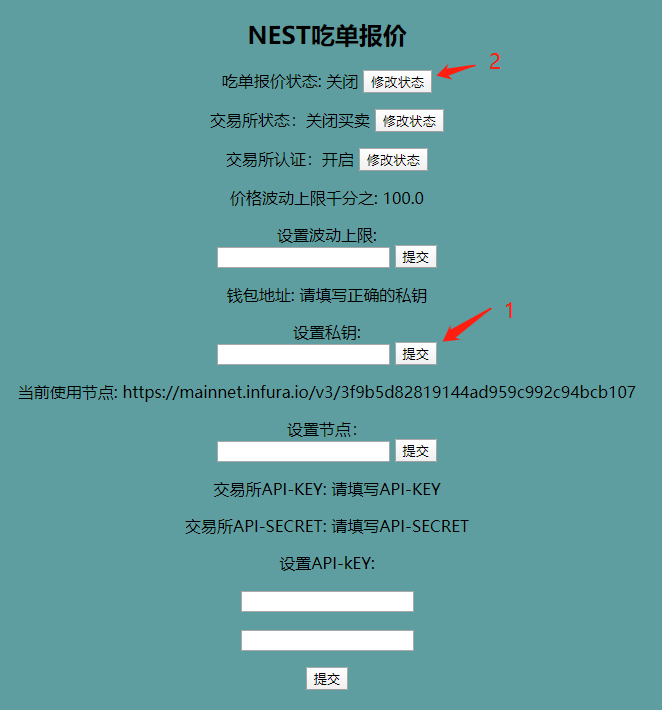
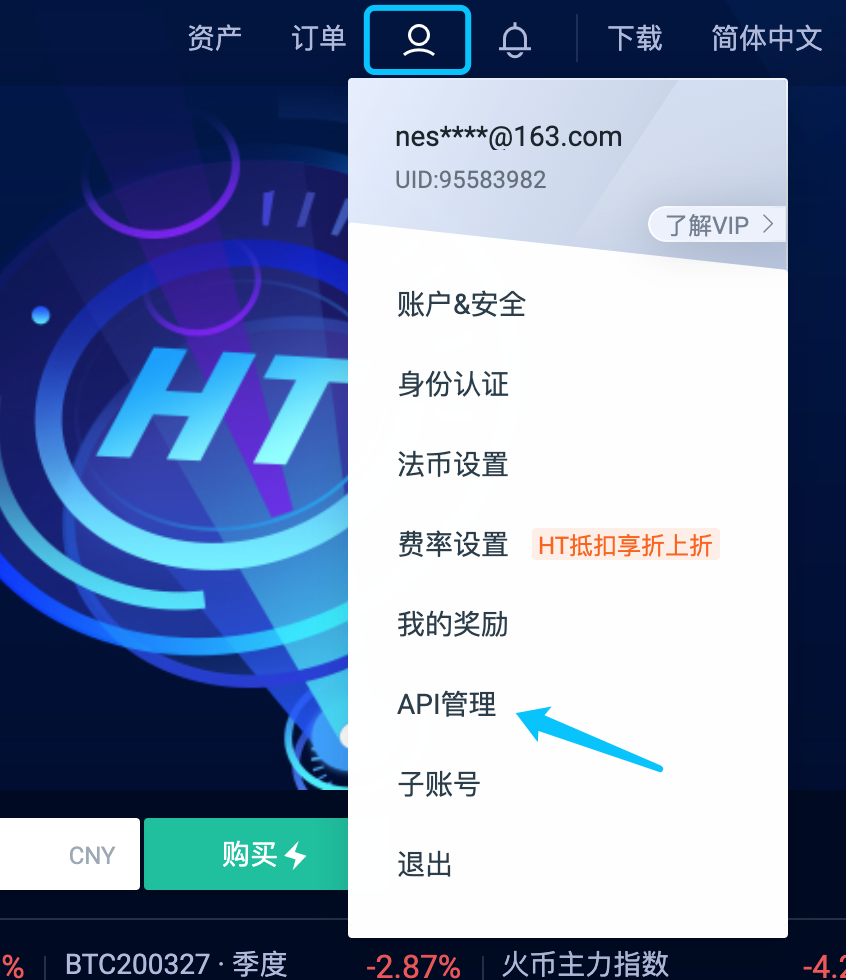
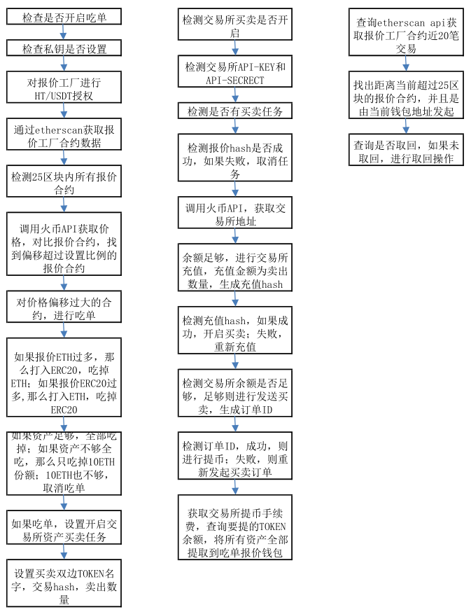
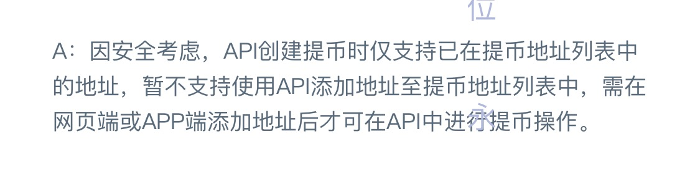

#### 一、启动步骤

1. 从github拉取代码：

   方式1： 
   	打开CMD使用命令：git clone  https://github.com/NestFans/NestEatOffer.git

   方式2：在github下载源码

   ```
   进入：https://github.com/NestFans/NestEatOffer.git，点击Download ZIP下载后解压到D盘
   ```

2. 找到start.bat文件，双击即可运行（运行后弹出的窗口不要关闭，此处可以看到运行信息）

3.  打开浏览器访问 http://127.0.0.1:8088/eatOffer/miningData , 出现如下界面

   

4. 设置吃单报价参数再启动

   * 第一步（必填）： 填写私钥并提交，界面会显示私钥对应的钱包地址。
   * 第二步（选填）： 设置波动上限并提交，输入值区间为 0 ~ 999，不填默认值为100（当其他人报价合约价格波动超过 100‰ 时, 会进行吃单报价）。
   * 第三步（选填）： 设置节点， 默认是infura节点，由于该节点存在访问上限，大家可以自己去<https://infura.io/> 注册一个节点。
   * 第四步（选填）： 设置API-KEY，如果吃单之后，资产不进行任何操作，可以不用填写。如果吃单之后想要变卖资产，可以去火币交易所申请开放API-KEY （下面会详细说明）。

   * 第五步（选填）： 设置交易所状态，默认为交易所已经经过认证，如果未认证，可点击对应的“修改状态”。 
   * 第六步（选填）： 设置交易所状态，默认关闭，开启必须先设置API-KEY。
   * 第七步（必填）： 设置吃单报价状态，点击对应的”修改状态“即开启吃单报价 

#### 二、火币交易所开放API-KEY

1. 登陆交易所，选择API管理

   

2. 创建API-KEY并开放权限。

   * 默认开放“读取”。例如：其他人报价10ETH：3000USDT，火币交易所实时价格：10ETH：2600USDT,那么吃单会打入10ETH，获取到3000USDT，此时会读取交易所USDT对应的充币地址，将3000USDT充入交易所。

   * 开放“交易”。例如：充值到的3000USDT，会进行市价买卖，卖出3000USDT获取ETH。
   * 开放“提币”。例如：卖出3000USDT获取了11.5ETH，会将11.5ETH提取到当前吃单报价钱包地址。

   

3. 填写好之后，点击“创建”，此时会显示：api-key 和 api-secret。将其填写到配置页面，并点击“提交”。

#### 三、吃单报价脚本流程图



#### 四、注意事项

1.  节点：默认使用infura免费节点，每天访问频率只能支持1万次，最好是每个人自己去申请一个免费节点。

2.  VPN：由于会使用火币API获取交易所实时成交价格，需要开启全局VPN。

3.  etherscanAPI：默认etherscan API-KEY为空，只支持每秒访问1次，所以打印日志信息会有报错提示，可以不用理会。有条件最好自己去注册一个etherscan API-KEY。

4. 吃单： 如果别人报价30ETH甚至更高，如果当前账户资产不够，不能全部吃掉。那么默认会只吃1份（10ETH）。如果有需要设置吃当前账户资产最大吃单金额，代码里面已经写好，开发者可以自己去调试。

5. 开放交易所买卖权限：可以根据自己的需要设置不同的权限，不需要可以不用开启交易所买卖 。

   * 如果开放了“提币”权限，根据火币规定，需要在 交易所提币地址列表中添加当前吃单报价钱包地址，否则无法提出。

     

6. 充提币：例如：吃单报价是打入10ETH，获取3000USDT，那么充值到交易所是3000USDT，并且卖出3000USDT，获得11.5ETH。但是提币是将扣除手续费之后的所有ETH全部提取到吃单报价钱包地址。（建议：吃单报价连接的交易所最好是没有任何资产的，以防对其他操作造成影响）